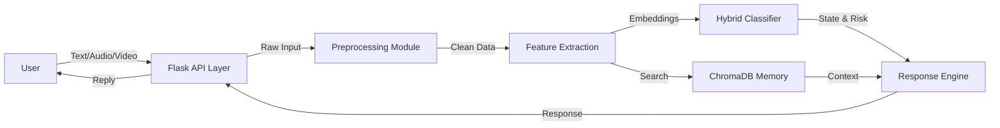

# Hybrid Input Mental Health Chatbot with Contextual Memory
### Final Year B.Tech Project

## Overview
This system is a multimodal conversational AI designed to provide empathetic mental health support. It uses a hybrid architecture combining rule-based CBT (Cognitive Behavioral Therapy) principles with advanced Machine Learning classifiers (Random Forest, XGBoost) and Deep Learning text embeddings (BERT).

**Key Features:**
- **Contextual Memory**: Uses ChromaDB to "remember" past user interactions.
- **Hybrid Input**: Supports Text (implemented) and has stubs for Audio (Whisper) and Video (MediaPipe).
- **Risk Assessment**: Heuristic and model-based risk scoring.
- **Safety First**: Integrated safety guards and keyword filtering.

## 📁 System Architecture
*(DFD Level 0)*


## 🚀 Setup Instructions

1. **Prerequisites**
   - Python 3.10+
   - PostgreSQL (Optional, defaults to SQLite for testing)

2. **Installation**
   ```bash
   # Clone the repository
   # cd into project directory

   # Install dependencies
   pip install -r requirements.txt
   ```

3. **Running the Application**
   ```bash
   # Run the Flask App
   python run.py
   ```
   - Access the App at: `http://localhost:5000`

## 📂 Project Structure
- `app/`: Main application logic.
- `input_preprocessing/`: Cleaning and raw data handlers.
- `feature_extraction/`: BERT, MFCC, and Visual feature logic.
- `classification/`: Hybrid Logic (RF/XGBoost/Neural).
- `contextual_memory/`: Vector database interface.
- `response_generation/`: CBT templates and LLM wrappers.
- `api/`: REST Endpoints.
- `frontend/`: HTML/JS/CSS.

## 🎥 Multimodal Extension
The system now supports **Single-Button Synchronized Audio & Video Input**.

### How it works (Viva Point):
1.  **Parallel Capture**: Frontend captures audio chunks (`MediaRecorder`) and video frames (`Canvas`) simultaneously.
2.  **Multithreaded Processing**: The backend uses `ThreadPoolExecutor` to process Audio (Whisper + Librosa) and Video (MediaPipe + OpenCV) in parallel threads to ensure low latency.
3.  **Feature Fusion**: Features are fused at the decision level using a weighted heuristic to determine the user's mental state.

### Key Modules Added:
- `api/multimodal_routes.py`: Flask blueprint for processing inputs.
- `input_preprocessing/sync_controller.py`: Manages parallel execution.
- `input_preprocessing/video_preprocess.py`: Extracts emotions from frames.
- `frontend/static/js/media_capture.js`: Browser API wrapper.

## 📊 System Architecture (Multimodal Level-1 DFD)
```mermaid
graph TD
    User -->|Click Mic| Frontend
    Frontend -->|Capture Audio+Frames| API[/api/multimodal_input]
    
    subgraph Backend Parallel Pipeline
        API -->|Thread 1| AudioProc[Audio Processor]
        API -->|Thread 2| VideoProc[Video Processor]
        
        AudioProc -->|Whisper| Text[Transcript]
        AudioProc -->|Librosa| AudioFeat[Prosody/Tone]
        
        VideoProc -->|MediaPipe| Face[Face Detection]
        Face -->|Emotion Model| FacialFeat[Visual Emotion]
    end
    
    Text -->|BERT| TextFeat[Text Embeddings]
    
    TextFeat & AudioFeat & FacialFeat --> Fusion{Decision Fusion}
    Fusion -->|Weighted Score| State[Predicted State]
    
    State --> CBT[CBT Response Engine]
    CBT --> Response
```

## ⚠️ Disclaimer
This is an academic project. It is not a licensed medical tool. In case of emergency, contact professional services.
